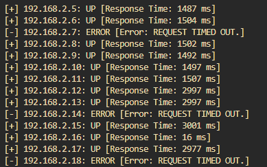
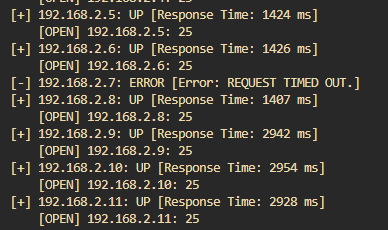

# Ip Address Scanner
Have you ever wanted to ping every IP host from one simple CIRD address? The answer to that is probably, "I've never ever wanted to do that." Well hopefully that answer will change after you run into this really cool and amazing tool. Whether you actually want to scan a whole network range or if you want to just try it out this tool makes it pretty easy to do so.

Feed one CIDR address into the python script and watch it work its magic as it tells you the status, response time, and possible error of each valid host.

## Set up and Installation

To get started, clone `scanner.py` using whatever method you'd like. After that, setting up and installing is as simple as ensuring the python file is inside of your working or current directory.

To start using the script type this simple command below:

- `python3 scanner.py [CIDR address]` This is all it takes to get the script running. Please ensure that you use a network that has given you permission to run a scan, and make sure that the range isn't super long (unless you want a million scans which would take a long time). 
        
    __*Note: If you're just looking to try it out, try `192.168.1.0/24`. It will scan a smaller network range (about 255 hosts in total) than some of the other private ranges. (may not work depending on your machine's ip).*__

An example of this standard output looks like this:

## Error Detection and Reply Features
There are a few common errors that you might run into while you're using this script. Here's a list and a small description of each:

1. __Invalid CIDR Address.__ Maybe you just forgot to type a little number you or you just put the wrong type of address in. The script will catch it and remind you to input a valid one with a little message! Just double check and try again. If all else fails, try a completely different address.

2. __[Error: None]__ This is an error output that you may get if the script can't ping the host. This is a normal reply from `stderr` from the `subprocess module`. Don't sweat it, it basically just means that the host wasn't reachable.

3. __[Error: REQUEST TIMED OUT.]__ The script gives each ping three seconds to run. Should the three seconds go by and the ping command is not executed it will time out and reply with this error. Try again, or wait a little bit before attempting it again.

    __*With some of these errors, if you run into it and then try it again a little later it will run the right way! Or simply a completely different way. During my testing, one host that would time out could recieve a ping during a test ran 2 minutes later.*__

## Port Scanning Feature
So maybe you want to not only scan a network range, but you also want to scan for some open ports within the range. Well I got you covered. I added a little something that let's you scan a port, or ports, or a port range along side your network scan! 

To use it, alter the original command to look like this:

- `python3 scanner.py -p [port(s)] [CIDR address]` For a single port, simply type in the port number like this `-p 80`. For a ports, seperate each port like a comma like this `-p 80,120,127`. And for a port range, denote it with a hyphen like this `-p 80-120`. You can also use `--ports` in place of `-p`.

An example of what the output may look like is this:

